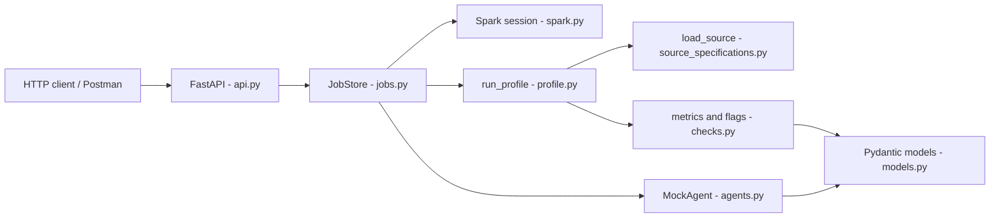

# data-inspect

A data quality profiler built on Spark, with FastAPI in front of it.

I use Spark for every metric: fill rates, duplicates, IQR outliers, date parse failures, and so on. There is an agent layer, but it never opens the dataset. It only reads the `DatasetProfile` JSON that Spark already produced, then writes a short summary or answers a question against those numbers. Python 3.13, PySpark 4.2, FastAPI, Pydantic v2.

---

## Contents

- [What it does](#what-it-does)
- [Architecture](#architecture)
- [Repository layout](#repository-layout)
- [Quick start](#quick-start)
- [HTTP API](#http-api)
- [How a profile is built](#how-a-profile-is-built)
- [Module reference](#module-reference)
- [Quality flags](#quality-flags)
- [Configuration](#configuration)
- [Samples](#samples)
- [Tests](#tests)
- [Databricks job](#databricks-job)
- [Things that are still rough](#things-that-are-still-rough)

---

## What it does

You point it at a table (CSV, Parquet, JSON, a list of dicts, a pickle, or JDBC) and it:

1. Loads the data with Spark.
2. Computes completeness, uniqueness, row duplicates, numeric Tukey fences, empty-string rates, boolean-like `true_rate`, and timestamp parse failures on date-looking string columns.
3. Turns those values into flags such as `low_fill:ssn` or `bad_dates:application_date`, plus a short list of recommended follow-up checks.
4. Optionally builds a `QualitySummary` in English from the JSON only.
5. Lets you ask something like `which columns are below 95% fill rate?` against a job that already ran.

It does not clean or rewrite rows. If a date is `not-a-date`, you get a failure rate, not a coerced timestamp in the source.

---

## Architecture



`MockAgent.summarize()` and `answer()` take a `DatasetProfile` and stop there. They do not call Spark a second time, which is why you can unit-test the agent without a JVM.

Two backends for the session:

| Backend | Where I use it | How the session is built |
|---|---|---|
| `local` | laptop and the default API | `SparkSession`, master `local[*]` |
| `databricks` | cluster or Databricks Connect | `DatabricksSession.builder.getOrCreate()` |

---

## Repository layout

```text
data_inspect/
├── src/data_inspect/          # package root (setuptools `where = ["src"]`)
│   ├── api.py                 # FastAPI routes
│   ├── jobs.py                # in-memory job store, sync and async run
│   ├── profile.py             # load → checks → DatasetProfile
│   ├── checks.py              # Spark aggregations and flag rules
│   ├── source_specifications.py
│   ├── spark.py               # local vs Databricks session
│   ├── agents.py              # MockAgent: JSON in, text out
│   ├── models.py              # request / response / profile schemas
│   └── config.py              # Settings from env
├── tests/
├── samples/                   # messy vs clean credit CSVs
├── databricks/job.py          # cluster entry: env vars → profile JSON
└── pyproject.toml
```

---

## Quick start

You need Python 3.13+, a JDK Spark will actually start with (17 or 21 in practice), and this repo.

```bash
conda activate data-inspect   # or: python -m venv .venv && source .venv/bin/activate
pip install -e ".[dev]"
```

The package lives under `src/`, so the editable install is what puts `data_inspect` on the path.

API:

```bash
uvicorn data_inspect.api:app --reload --host 127.0.0.1 --port 8000
```

Swagger is at [http://127.0.0.1:8000/docs](http://127.0.0.1:8000/docs). `/` redirects there.

Same profiler without HTTP:

```python
from data_inspect.profile import run_profile
from data_inspect.spark import get_spark

spark = get_spark("local")
profile = run_profile(spark, "samples/messy_credit.csv")
print(profile.flags)
print(profile.model_dump_json(indent=2))
```

`run_profile` takes a filesystem path, a `sourceSpecs` instance, or a dict with the same shape as the HTTP `source` field.

---

## HTTP API

There is no auth yet. If you bind this to a public hostname, anyone who can reach the port can run Spark jobs.

### `GET /health`

Confirms the process is up and lists the ingest types registered in `READERS`.

```json
{
  "status": "ok",
  "version": "0.1.0",
  "spark_backend": "local",
  "agent_backend": "abc1234",
  "source_types": ["csv", "jdbc", "json", "parquet", "pickle", "records"]
}
```

`agent_backend` is whatever `AGENT_API_KEY` is set to. It is a leftover placeholder and is not checked on incoming requests.

### `POST /v1/analyze`

Body is `AnalyzeRequest`.

| Field | Default | What it does |
|---|---|---|
| `source` | required | `sourceSpecs`: type plus path, records, or JDBC fields |
| `backend` | `"local"` | `"local"` or `"databricks"` |
| `summarize` | `true` | run `MockAgent.summarize` after the Spark profile |
| `async_run` | `false` | return a pending job immediately; poll `GET /v1/jobs/{job_id}` |

A CSV path has to exist on the machine running uvicorn, not on the caller:

```json
{
  "source": { "type": "csv", "path": "/absolute/path/to/samples/messy_credit.csv" },
  "summarize": true
}
```

If you do not want to touch disk, send rows inline:

```json
{
  "source": {
    "type": "records",
    "records": [{ "id": 1 }, { "id": 2, "ssn": null }]
  },
  "summarize": false
}
```

The response is a `JobStatus`: `job_id`, `status` (`pending` / `running` / `succeeded` / `failed`), `profile`, and optionally `summary` or `error`.

### `POST /v1/analyze/upload`

`multipart/form-data`. The file is written to a temp path, `infer_spec` picks the reader from the suffix (`.csv`, `.parquet`, `.json`, …), then it goes through the same analyze path.

Form fields: `file` (required), `backend`, `summarize`, `async_run`.

### `GET /v1/jobs/{job_id}`

Returns the current snapshot from the in-memory store. Unknown ids are `404`. Restarting the process loses every job.

### `POST /v1/ask`

```json
{
  "job_id": "<uuid from analyze>",
  "question": "which columns are below 95% fill rate?"
}
```

You get `409` unless the job is `succeeded` and has a profile. The matcher is keyword-based: `fill` / `null`, `flag`, `true rate` / `default`, and `row` together with `count`. A percentage in the question (`95%`) overrides the default 0.95 fill cutoff.

---

## How a profile is built

The call chain is `jobs.run_job` → `profile.run_profile` → functions in `checks.py`.

1. `_as_spec` turns a path, dict, or existing model into `sourceSpecs`. Paths go through the suffix map (`.csv` → csv, `.tsv` → csv with `sep=\t`, and so on).
2. `load_source` dispatches on `type` to the matching Spark reader.
3. Dataset-level work: `df.count()`, a single `completeness` aggregation (nulls and distinct counts per column), and `duplicate_rows` over the full row. If you passed `key=` into `run_profile`, it also computes duplicate rate on that identifier.
4. Per column: fill / null rate, uniqueness, `is_constant`, optional `true_rate` (only if the column looks boolean and cardinality is small enough), `numeric_stats` or `string_stats`, and `date_fail_rate` for string columns whose names look like dates.
5. `build_flags` and `recommend` using the thresholds in `Settings`.
6. A sample: `df.limit(SAMPLE_ROWS).collect()`.

CSV reads use `header=true`, `inferSchema=true`, and treat empty strings as null.

Date columns are parsed with `try_to_timestamp`. Spark 4 ANSI mode would otherwise throw on `not-a-date` and kill the job. The failure rate is `(nulls after parse − original nulls) / row_count`.

For `type=records`, keys are unioned across rows so a field that only appears later still exists. If Spark cannot infer a type (typically an all-null column), the fallback is to recast every field to string and retry.

---

## Module reference

### `source_specifications.py`

`sourceSpecs` is the ingest contract both HTTP and Python go through.

| `type` | Required | Reader |
|---|---|---|
| `csv` / `parquet` / `json` / `pickle` | `path` | Spark file reader, or pickle → records |
| `records` | `records=[...]` | `spark.createDataFrame` |
| `jdbc` | `url` and either `query` or `table` | Spark JDBC |

`infer_spec(path)` understands `.csv`, `.tsv`, `.parquet`, `.pq`, `.json`, `.jsonl`, `.pkl`, `.pickle`. Extra `options` are applied as Spark reader options (values coerced to `str`).

Pickle uses `pickle.loads`. That is only acceptable for files you already trust.

### `checks.py`

| Function | What it computes |
|---|---|
| `completeness` | One aggregation: null count and distinct count per column |
| `duplicate_rows` | `row_count − dropDuplicates(...)`; all columns, or a key subset |
| `uniqueness` | `distinct_count / non_null_count` |
| `looks_boolean` / `true_rate` | Tokens `true/1/yes/t/y` vs `false/0/no/n/f` |
| `numeric_stats` | min, max, mean, stddev, approx Q1/Q3, IQR outlier rate (1.5× fence) |
| `string_stats` | empty-string rate, min/max length |
| `looks_date` | `DateType` / `TimestampType`, or a string name containing `date`, `_dt`, `time`, `ts`, `datetime` |
| `date_fail_rate` | extra nulls after `try_to_timestamp` |
| `build_flags` / `recommend` | threshold → `low_fill:col` style flags → checklist strings |

`run_profile` only runs the boolean path when `spark_type == "boolean"` or `distinct_count` is at most the size of the token set, so a free-text column does not get treated as a flag.

### `profile.py`

Orchestration only. No aggregations live here; it always returns a `DatasetProfile`.

### `models.py`

Pydantic models shared by the API and the agent: `NumericStats`, `StringStats`, `ColumnProfile`, `DatasetProfile`, `QualitySummary`, plus `AnalyzeRequest`, `AskRequest`, `JobStatus`, `AnalyzeResponse`, `AskResponse`.

### `jobs.py`

`JobStore` is a process-local `dict` behind a lock. `get()` returns a deep copy so a caller cannot mutate what is stored.

Synchronous analyze is `create` then `run_job` (Spark, then optional summarize). `async_run` starts a daemon thread and expects the client to poll. There is no Redis or database behind this.

### `spark.py`

In local mode I set `PYSPARK_PYTHON` and `PYSPARK_DRIVER_PYTHON` to `sys.executable` before `getOrCreate()`. Otherwise a worker can pick a different minor version off `PATH` and Spark aborts. The Spark UI is disabled, the session timezone is UTC, and `SPARK_JARS` is optional for JDBC drivers.

### `agents.py`

`MockAgent` is the only implementation. `get_agent()` ignores backend for now; there is a comment where an OpenAI path would go. Summaries list the lowest-fill columns, true rates, and flags. Answers are regex / keyword routing over the profile.

### `config.py`

Frozen `Settings` dataclass. `get_settings()` reads the environment each time it is called.

### `api.py`

Validates the body, calls `STORE` / `run_job` / `submit_async`, and maps missing jobs to `404` / `409`. Upload runs `infer_spec` on the temp file.

---

## Quality flags

`build_flags` produces these. Cutoffs are env vars (see [Configuration](#configuration)).

| Flag | Condition |
|---|---|
| `low_fill:{col}` | `fill_rate < FILL_RATE_THRESHOLD` (default `0.7`) |
| `constant:{col}` | `distinct_count <= 1` |
| `outliers:{col}` | IQR outlier rate `> OUTLIER_RATE_THRESHOLD` (default `0.2`) |
| `degenerate_boolean:{col}` | `true_rate` is exactly `0.0` or `1.0` |
| `bad_dates:{col}` | date parse failure rate `> 0` |
| `pk_candidate:{col}` | uniqueness is `1.0` and the name ends with `_id` |
| `dup_key: {key}` | identifier duplicate rate `> 0` (only if `run_profile(..., key=...)`) |

`recommend()` maps those prefixes to a short checklist: trace low-fill columns to the source system, quarantine rows that fail the date cast, measure duplicate-key rate on a natural key if nothing looked like a PK, and so on.

On `samples/messy_credit.csv` you should see `constant:country` and `bad_dates:application_date`. SSN fill is about 73%, so `low_fill:ssn` does not fire at the default 0.7 threshold; the checks test raises it to 0.8 to assert that flag.

---

## Configuration

| Variable | Default | Used for |
|---|---|---|
| `SPARK_KEY` | `local` | Spark backend (`local` / `databricks`) |
| `AGENT_API_KEY` | `abc1234` | placeholder; not request authentication |
| `SAMPLE_ROWS` | `100` | rows copied into `profile.sample_rows` |
| `FILL_RATE_THRESHOLD` | `0.7` | `low_fill` flag |
| `OUTLIER_RATE_THRESHOLD` | `0.2` | `outliers` flag |
| `SPARK_APP_NAME` | `data_insights` | Spark application name |
| `SPARK_JARS` | unset | comma-separated JARs for the local session |

Extras in `pyproject.toml`: `.[databricks]`, `.[agents]` (LangChain is declared but `get_agent` does not use it yet), `.[dev]` for pytest and httpx.

---

## Samples

| File | What is in it |
|---|---|
| `samples/messy_credit.csv` | 15 rows, a duplicated application, missing SSNs, `not-a-date`, mixed boolean tokens (`Y`/`true`/`1`), constant `country` |
| `samples/clean_credit.csv` | same schema, complete SSN, no duplicate rows |

I use these for local `POST /v1/analyze` and for `pytest tests/test_checks.py`.

---

## Tests

```bash
pytest tests/ -q
```

`tests/conftest.py` builds a session-scoped Spark (`local[1]`, UTC, UI off) and pins worker Python the same way `get_spark("local")` does.

| File | What it covers |
|---|---|
| `test_ingest.py` | records (including an all-null column), CSV row count, unknown `type` |
| `test_checks.py` | `true_rate`, boolean heuristics, `date_fail_rate`, messy vs clean profiles |
| `test_api.py` | `/health`, analyze + ask on the messy CSV, records payload |
| `test_agent.py` | summary and fill-rate Q&A with no Spark |

---

## Databricks job

`databricks/job.py` is a cluster entrypoint, not the FastAPI app. It reads `SOURCE_TYPE` and `SOURCE_PATH` (or JDBC via `SOURCE_URL` plus `SOURCE_QUERY` / `SOURCE_TABLE`), uses whatever `SparkSession` the cluster already has, runs `run_profile(..., backend="databricks")`, and writes JSON to `OUTPUT_PATH` or stdout.

Set `SOURCE_TYPE=infer` with `SOURCE_PATH` if you want suffix-based type detection.

---

## Things that are still rough

- The HTTP API has no authentication.
- Jobs live in a dict in the uvicorn process. They are not shared across workers and they disappear on restart.
- A `path` in `/v1/analyze` is a path on the API host. For a caller on another machine, use `type=records` or `/v1/analyze/upload`.
- `MockAgent` is not an LLM. Wiring `get_agent()` to OpenAI is still a comment.
- `run_profile(..., key=)` exists in Python (identifier duplicate rate) but is not a field on `AnalyzeRequest` yet.
- Local Spark needs a JVM and a reasonable heap. A 512 MB PaaS instance will usually OOM.
